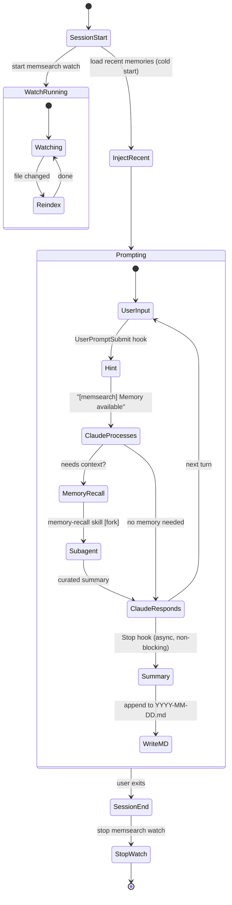

# Hooks

The plugin hooks into **4 Claude Code lifecycle events** and provides a **memory-recall skill**. A singleton `memsearch watch` process runs in the background, keeping the vector index in sync with markdown files as they change. (Milvus Lite falls back to one-time indexing at session start.)

## Lifecycle Diagram

## Hook Summary

The plugin defines exactly 4 hooks, all declared in `hooks/hooks.json`:

| Hook | Type | Async | Timeout | What It Does |
|------|------|-------|---------|-------------|
| **SessionStart** | command | no | 10s | Start `memsearch watch` singleton, write session heading to today's `.md`, inject recent daily logs as cold-start context via `additionalContext`, display config status (provider/model/milvus) in `systemMessage` |
| **UserPromptSubmit** | command | no | 15s | Lightweight hint: returns `systemMessage` "[memsearch] Memory available" (skip if < 10 chars). No search — recall is handled by the memory-recall skill |
| **Stop** | command | **yes** | 120s | Extract last turn from transcript with `parse-transcript.sh`, call `claude -p --model haiku` to summarize as third-person notes, append summary with session/turn anchors to daily `.md` |
| **SessionEnd** | command | no | 10s | Stop the `memsearch watch` background process (cleanup) |

## What Each Hook Does

### SessionStart

Fires once when a Claude Code session begins. This hook:

1. **Reads config and checks API key.** Runs `memsearch config get` to read the configured embedding provider, model, and Milvus URI. Checks whether the required API key is set for the provider (`OPENAI_API_KEY`, `GOOGLE_API_KEY`, `VOYAGE_API_KEY`; `ollama` and `local` need no key). If missing, shows an error in `systemMessage` and exits early.
2. **Starts the watcher.** Launches `memsearch watch .memsearch/memory/` as a singleton background process (PID file lock prevents duplicates). The watcher monitors markdown files and auto-re-indexes on changes with a 1500ms debounce. Milvus Lite falls back to a one-time `memsearch index` at session start.
3. **Writes a session heading.** Appends `## Session HH:MM` to today's memory file (`.memsearch/memory/YYYY-MM-DD.md`), creating the file if it does not exist.
4. **Injects cold-start context.** Reads the last 30 lines from the 2 most recent daily logs and returns them as `additionalContext`. This gives Claude awareness of recent sessions, which helps it decide when to invoke the memory-recall skill.
5. **Checks for updates.** Queries PyPI (2s timeout) and compares with the installed version. If a newer version is available, appends an `UPDATE` hint to the status line.
6. **Displays config status.** Every exit path returns a `systemMessage` showing the active configuration, e.g. `[memsearch v0.1.10] embedding: openai/text-embedding-3-small | milvus: ~/.memsearch/milvus.db | collection: ms_my_app_a1b2c3d4` (with `| UPDATE: v0.1.12 available` when outdated).

### UserPromptSubmit

Fires on every user prompt before Claude processes it. This hook:

1. **Extracts the prompt** from the hook input JSON.
2. **Skips short prompts** (under 10 characters) -- greetings and single words don't need memory hints.
3. **Returns a lightweight hint.** Outputs `systemMessage: "[memsearch] Memory available"` -- a visible one-liner that keeps Claude aware of the memory system without performing any search.

The actual memory retrieval is handled by the **[memory-recall skill](progressive-disclosure.md#how-the-skill-works)**, which Claude invokes automatically when it judges the user's question needs historical context.

### Stop

Fires after Claude finishes each response. Runs **asynchronously** so it does not block the user. This hook:

1. **Guards against recursion.** Checks `stop_hook_active` to prevent infinite loops (since the hook itself calls `claude -p`).
2. **Validates the transcript.** Skips if the transcript file is missing or has fewer than 3 lines.
3. **Parses the last turn.** Calls `parse-transcript.sh`, which:
    - Scans backward from EOF to find the last real user message (content is a string, not a `tool_result`)
    - Extracts only the last turn: from that user message to EOF
    - Skips `progress`, `file-history-snapshot`, `system`, and `thinking` blocks
    - Formats output with clear role labels: `[Human]` for user messages, `[Claude Code]` for assistant text, `[Claude Code calls tool]` for tool invocations, `[Tool output]`/`[Tool error]` for tool results — these labels help the summarizer treat the content as a third-party transcript rather than its own conversation
    - Truncates tool results to 1000 characters; uses Python 3 (no `jq` dependency)
4. **Summarizes with Haiku.** Pipes the parsed last turn to `claude -p --model haiku --no-session-persistence` with an external-observer system prompt that requests 2-6 third-person bullet points recording what the user asked and what Claude did (tools called, files changed, key findings). The summary language matches the user's language.
5. **Appends to daily log.** Writes a `### HH:MM` sub-heading with an HTML comment anchor containing session ID, turn UUID, and transcript path. Then explicitly runs `memsearch index` to ensure the new content is indexed immediately, rather than relying on the watcher's debounce timer (which may not fire before SessionEnd kills the watcher).

### SessionEnd

Fires when the user exits Claude Code. Simply calls `stop_watch` to kill the `memsearch watch` process and clean up the PID file, including a sweep for any orphaned processes.
